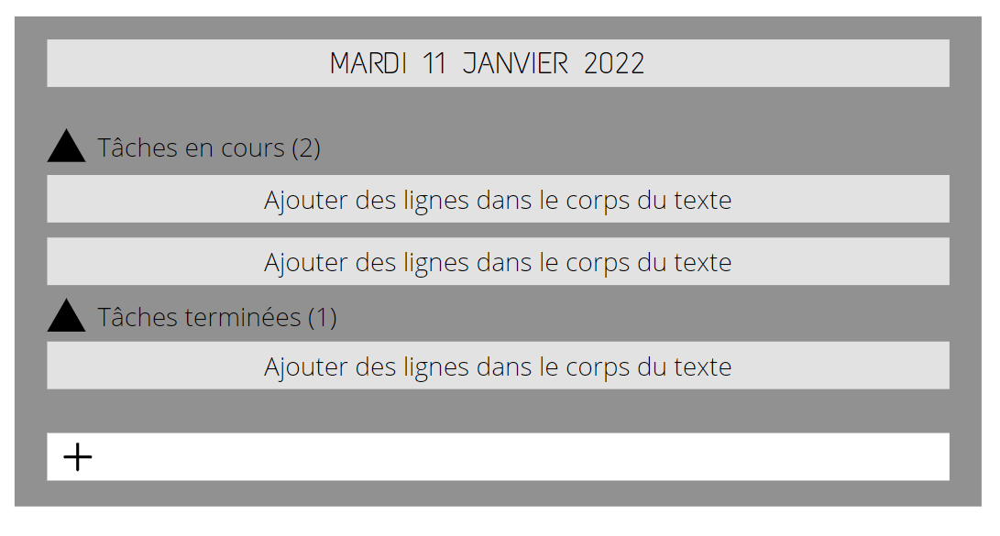
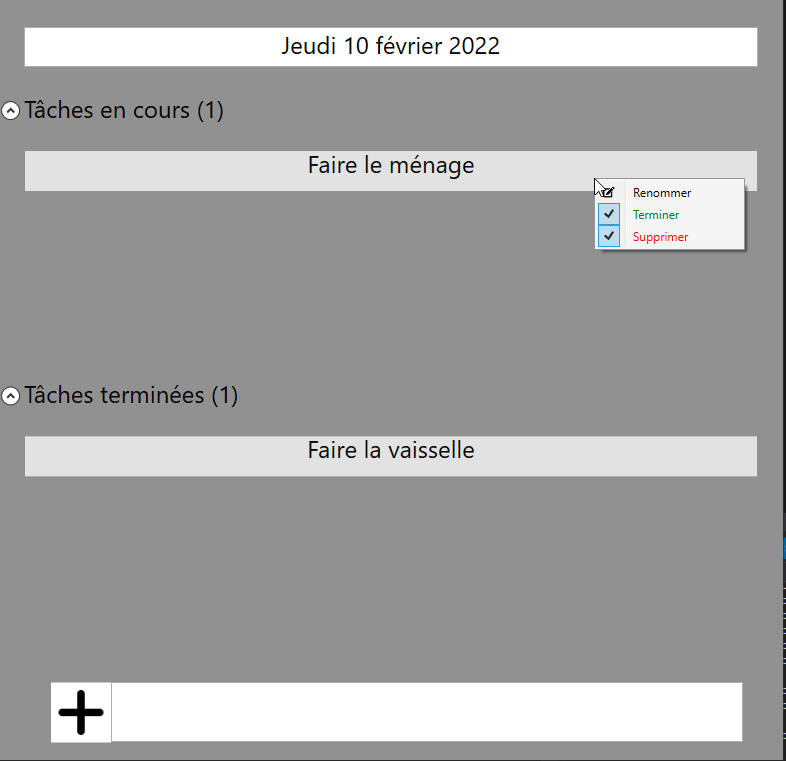
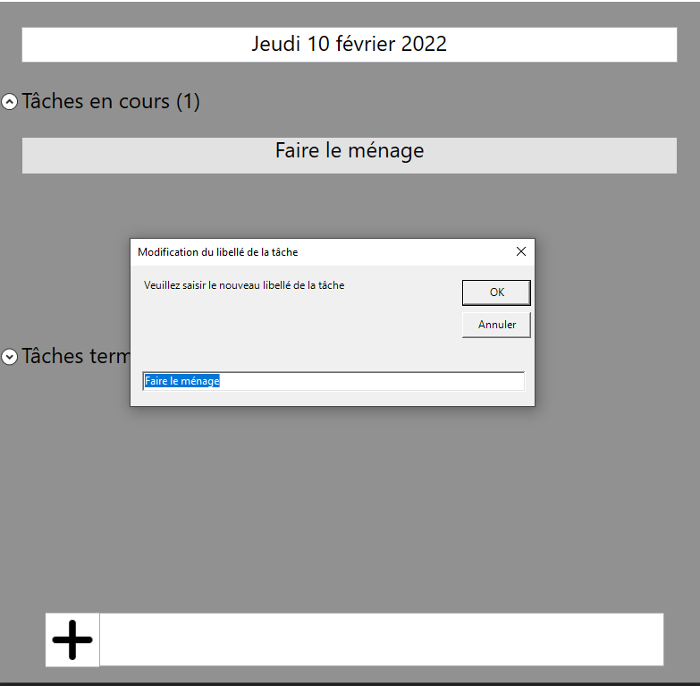

# TODO LIST WPF

Vous devez creer une application qui gère une liste de tâches a effectuer. Vous devez utiliser les technologies suivante : C#, SQLite pour le stockage des données.

# Wireframe

# Raccourcis

- Appuyer sur CtrlLeft pour accéder à l'input d'ajout de tâche
- Appuyer sur Entrer pour ajouter la tâche
# Tâches

- [x] Veille sur SQLite avec C#
- [x] Maquéter l'application
- [x] Créer la classe de connexion à la BDD et les CRUD
- [x] Créer la classe principale des tâches
- [x] Créer l'interface utilisateur
- [x] Ajouter la modification du libellé d'une tâche
- [x] Ajouter la gestion des raccourcis pour ajouter une tâche
- [] Ajouter une légende ou menu aide pour les raccourcis
- [] Améliorer le design
- [] Permettre l'ajout d'une image en background

# Rendu final de l'interface

# Versions à venir

- Pomodoro

