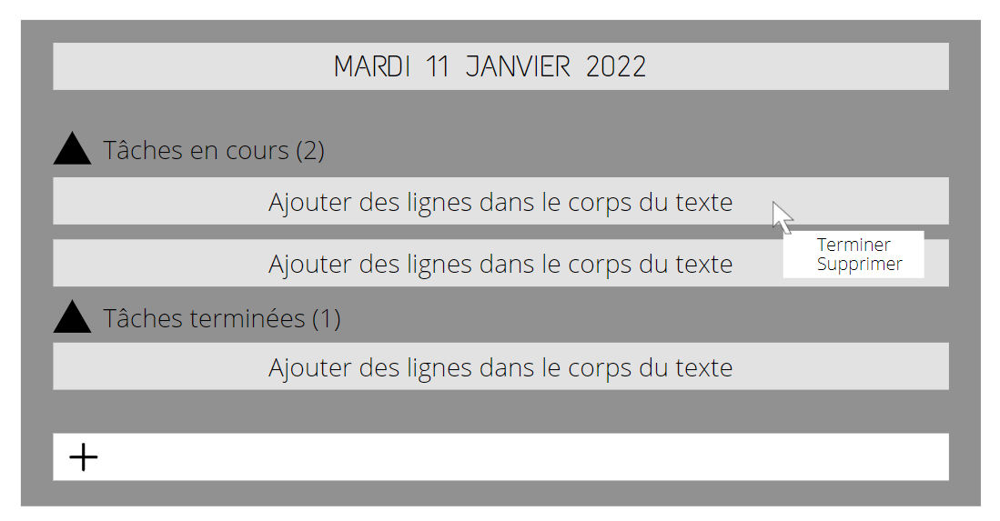

# TODO LIST WPF

Vous devez creer une application qui gère une liste de tâches a effectuer. Vous devez utiliser les technologies suivante : C#, SQLite pour le stockage des données.

# Wireframe

# Tâches

- [x] Veille sur SQLite avec C#
- [x] Maquéter l'application
- [x] Créer la classe de connexion à la BDD et les CRUD
- [x] Créer la classe principale des tâches
- [x] Créer l'interface utilisateur
- [] Améliorer le design

